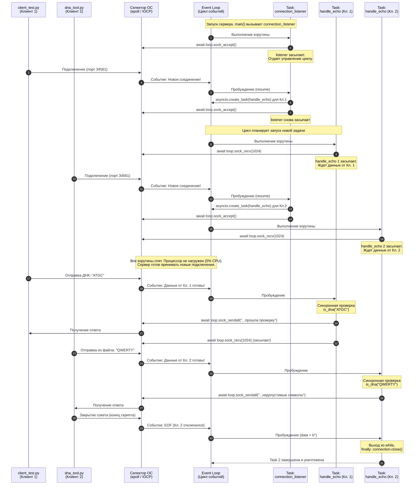

# web_server

```mermaid
sequenceDiagram
    autonumber
    participant C1 as client_test.py<br/>(Клиент 1)
    participant C2 as dna_tool.py<br/>(Клиент 2)
    participant OS as Селектор ОС<br/>(epoll / IOCP)
    participant EL as Event Loop<br/>(Цикл событий)
    participant L as Task:<br/>connection_listener
    participant H1 as Task:<br/>handle_echo (Кл. 1)
    participant H2 as Task:<br/>handle_echo (Кл. 2)

    Note over EL, L: Запуск сервера. main() вызывает connection_listener
    EL->>L: Выполнение корутины
    L->>OS: await loop.sock_accept()
    Note over L: listener засыпает.<br/>Отдает управление циклу.

    C1->>OS: Подключение (порт 34561)
    OS->>EL: Событие: Новое соединение!
    EL->>L: Пробуждение (resume)
    L->>EL: asyncio.create_task(handle_echo) для Кл.1
    L->>OS: await loop.sock_accept()
    Note over L: listener снова засыпает

    Note over EL, H1: Цикл планирует запуск новой задачи
    EL->>H1: Выполнение корутины
    H1->>OS: await loop.sock_recv(1024)
    Note over H1: handle_echo 1 засыпает.<br/>Ждет данные от Кл. 1

    C2->>OS: Подключение (порт 34561)
    OS->>EL: Событие: Новое соединение!
    EL->>L: Пробуждение (resume)
    L->>EL: asyncio.create_task(handle_echo) для Кл.2
    L->>OS: await loop.sock_accept()
    
    EL->>H2: Выполнение корутины
    H2->>OS: await loop.sock_recv(1024)
    Note over H2: handle_echo 2 засыпает.<br/>Ждет данные от Кл. 2

    Note over OS, EL:  Все корутины спят. Процессор не нагружен (0% CPU).<br/>Сервер готов принимать новые подключения.

    C1->>OS: Отправка ДНК: "ATGC"
    OS->>EL: Событие: Данные от Кл. 1 готовы!
    EL->>H1: Пробуждение
    Note over H1: Синхронная проверка<br/>is_dna("ATGC")
    H1->>OS: await loop.sock_sendall("...прошла проверку")
    OS->>C1: Получение ответа
    H1->>OS: await loop.sock_recv(1024) (засыпает)

    C2->>OS: Отправка из файла: "QWERTY"
    OS->>EL: Событие: Данные от Кл. 2 готовы!
    EL->>H2: Пробуждение
    Note over H2: Синхронная проверка<br/>is_dna("QWERTY")
    H2->>OS: await loop.sock_sendall("...недопустимые символы")
    OS->>C2: Получение ответа
    
    C2->>OS: Закрытие сокета (конец скрипта)
    OS->>EL: Событие: EOF (Кл. 2 отключился)
    EL->>H2: Пробуждение (data = b'')
    Note over H2: Выход из while,<br/>finally: connection.close()
    H2-->>EL: Task 2 завершена и уничтожена
```
